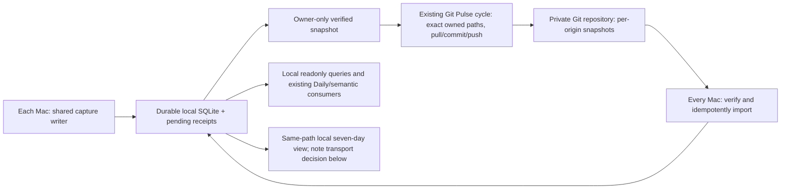

# CLIO without a required Mac — replicated SQLite through Git Pulse

Date: 2026-10-02. Status: revised plan and implementation independently approved; CLIO #5 merged and Studio fleet integration deployed through Rebalance #303. Four-Mac/offline/shared-note qualification remains open. Canonical issue: https://github.com/HiQS-Labs/XYZ-CLIO/issues/3 . Recon: [recon-gh3-device-independent.md](recon-gh3-device-independent.md).

This supersedes the permanent Studio-hub assumption in gh3-plan.md and gh3-same-path-plan.md. Their shipped capture, verified backup, same-path header and accepted-gap contracts remain. This is a plan, not authorization to upload private history, restart other Macs, change Sync settings, or modify installed jobs during this turn.

## Confirmed requirements, target outcome and limits

The operator requires that, after the disconnected pilot and staged rollout, every Mac retain a complete replica of all delivered CLIO history, capture locally even offline, query locally and refresh the SAME existing Obsidian note while the Studio is off. Use the existing deployed Git Pulse cadence (Studio collector currently hourly); this is a scheduling requirement, not a delivery guarantee. No Mac is a mandatory receiver, merger, pusher or permanent note publisher. The logical central history is the union of verified origin snapshots in the private Git Pulse repository; each SQLite file is a queryable replica plus its own durable unsent events. There is no new SQL server or one privileged SQLite binary in Git.

A Mac can only know records already delivered or captured locally; an offline peer's unsent prompts cannot be visible elsewhere. Capture survives a powered-off peer; unsent records on a physically lost source disk may still be lost. GitHub availability remains necessary for cross-device delivery, but offline capture/query/local projection continue. Existing historical gaps remain accepted, with full original note backups retained; no reconstruction or recovery chase.

## Smallest architecture

Use the current local store, not a temporary SQL file: an OS temp purge must never lose the capture queue. Temporary files are only atomic serialization staging. One store per Mac can hold local AND imported records; a separate staging database and a second aggregate database add no value. Keep the established local DB path and configuration resolver on each Mac.

Each store owns a persistent CLIO origin UUID. Names/hardware UUIDs are inventory/display mappings, not rewritten event identities. Existing adoption origins from imported MBP histories remain intact; either adopt their store on that device deliberately or keep them as separate legacy seed origins and create a new owner for future capture. Never clone the Studio activation config/owner onto another active writer. Stable record IDs, payloads, unknown metadata and references survive import/rebuild.

Reuse `export-device` / `import-device`: one atomic versioned manifest plus canonical records, owner UUID, UTC generation, count and SHA-256. Transport cumulative owner-only snapshots under `devices/<origin-UUID>/clio.jsonl`, already the CLIO contract. Each path has exactly one producer; imported rows never echo through another origin. Full snapshots are the initial minimum mechanism, not chunks/deltas/compaction. Measure private Git growth during pilot before adding any such machinery.

## Reconciliation on the existing cycle

Rebalance owns integration into its existing Git Pulse collector/publisher, subject to #282. CLIO does not get its own pusher, watcher, cron, lease service, vector store or XYZ ledger writer. Keep one existing Git pusher per Mac, one checkout lock and exact staging allowlists; preserve foreign dirty/staged paths by refusing, never broad `git add`, stash, reset, force-push or automatic conflict erasure.

The scheduled cycle acquires the existing local Git publication lock, drains bounded local pending receipts, exports this owner to PRIVATE staging outside the checkout, verifies its manifest, and hands the exact owned path to the existing publication transaction. Persist pending local commits before pulling as existing publisher does; pull only through its safe reconciliation path. Never leave an uncommitted CLIO file for some later job to discover and accidentally wedge pull/rebase.

After pull, import every recognized foreign origin snapshot from the committed tree, NOT arbitrary dirty worktree bytes. Match pathname origin to manifest.owner; verify version, digest, count and all record identities. Track the last accepted digest per origin in existing import receipts. Unchanged payloads need not re-import just because generated_at changed. One transaction per origin: rejected/truncated/conflicting snapshots change no rows for that origin. An unchanged valid replay adds zero. Import committed snapshots before an attempted network push can fail, so known pulled history still becomes locally queryable.

Publish through the existing exact-path commit/push routine, at most its one race retry. A failed push leaves local SQLite and durable pending Git commits intact; next scheduled cycle retries delivery even if capture has no new rows. A busy lock skips that cycle with an honest status; no unbounded retry. A cumulative snapshot must not silently regress: compare known IDs/owner before replacing its prior snapshot, retain acknowledged local rows even if remote old versions reappear, and never use a smaller snapshot as a deletion instruction. Conflicting same record ID/payload stops that origin's import; independent valid origins may still import with partial-coverage status.

Optionally offset existing jobs by a deterministic device offset within their current interval, preserving frequency. This is load spreading only: simultaneous wake, drift and overlap remain correct through local lock + disjoint origin paths + existing Git race retry. No correctness rule or delivery guarantee relies on staggering.

## Complete-history bootstrap and recovery

Before road use, publish ALL existing accepted history by original origin, not merely the current Studio owner. Its two foreign adoption histories would otherwise disappear from export-device. Use retained adoption stores and the existing owner exports, or a narrow existing-helper export-by-preserved-origin extension if those stores cannot be reused. Stage and verify owner/count/digest for each seed; no ID rewriting. Never upload original private records to the public CLIO implementation repository.

Initialize each receiving Mac with its own owner or deliberate matching adoption-store owner, then import every OTHER known origin and retain its own local rows. Self-import is deliberately refused; its own history is already present. A trusted known-origin inventory records expected sources and legacy adoption mapping, separate from hardware naming. No machine must remain online after it delivers a seed. A fresh replica rebuilds from all committed seed/current snapshots. Removing a replica is never removal of history; keep its owner snapshots and backups. Reinstall uses existing origin/config if present; ambiguous reuse by two writers fails pilot qualification.

Query/Daily/semantic consume the local combined replica or existing chronological compatibility JSONL. Reuse the existing Rebalance CLIO provider/index registry/semantic store and readonly XYZ ledger joins; replication does not introduce another search index or ledger authority. Replication status exposes expected origins, last successful local capture/drain, accepted snapshot digest/generated UTC, last remote delivery receipt, last import and error per origin. It distinguishes full-known-history from stale/missing device coverage and alive-but-not-delivering. Never infer completeness from row count alone.

## Same Obsidian path without a permanent publisher

Database replication and note publication are separate safety questions. The current accepted-hash guard and Git checkout OS lock cannot fence another Mac's Obsidian Sync writes. Staggered timers or a Git lease with an unfenced local filesystem are not sufficient: a partitioned old owner can resume and upload stale note bytes.

Earlier transport alternatives (superseded by the automatic-recovery requirement below):

**A. Git Pulse transports this note; each Mac renders its own local view (preferred if exact-file Sync exclusion can be proven).** On EVERY participating vault, exclude ONLY the exact existing root note from Obsidian Sync before enabling a second projector. Keep its path/filename and all other vault syncing unchanged. Verify installed product supports this exact exclusion; official docs currently describe folder exclusion, so capability is not assumed. Never relocate the note or disable Sync for the whole vault to simulate compliance. With file exclusion verified, note is a local derived projection, not a shared multiwriter input: every Mac's existing five-minute job can render from its full replica while the Studio is off. The Git transport contains owner records and a versioned canonical header, not a multiwriter rolling-note binary. A travelling Mac includes its local unsent captures in its view; differing cutoffs are safe because these note bytes do not travel through a competing sync channel. Header changes are explicit compare-against-known-version edits via the existing Git transaction, not merged implicitly into generated body; divergent edits preserve both and stop header adoption. Preserve each original personal header/body/config in verified local backups. Local unexpected edits still refuse replacement for reconciliation. Mobile clients without this renderer are out of scope until explicitly added; do not claim automatic mobile freshness.

**B. Keep Obsidian Sync and manually transfer the one publisher.** Capture/query remain fully independent on all Macs. On road departure, explicitly stop and verify former projector, import current history and transfer note registration/header/hashes to the chosen travel Mac using verified backups; resume only its existing projector. No fixed Studio dependency, but automatic note recovery after unplanned publisher loss is NOT solved. An unreachable old owner cannot safely be assumed disabled. This option needs explicit acceptance of manual handover and stale note during ambiguous partitions; it is not the automatic no-hub note outcome.

If A cannot be demonstrated and B does not meet the requested outcome, stop note rollout and return a specific unresolved design choice; do not sign off with an implicit Studio owner. Database capture/replication can still be implemented independently. No distributed note lease/failover machinery is introduced just to conceal a second sync channel.

## Ordered implementation and proof

1. Land the currently reviewed CLIO implementation and retain private backups/adoption mapping; resolve native Rebalance intake for #282 and CLIO snapshot adapter. → one canonical issue/plan per implementation repo, no duplicate publisher.
2. Qualify exact publisher ownership and private data repo access; implement the adapter at the read recon seams in collector/git_ops. → owner-only paths under existing lock/staging, bounded retries and remote-byte receipt. No uncommitted integration artifact wedges pull. Keep existing cadence.
3. Bootstrap all retained history origins, then install a full replica on the travel Mac and a second peer. → exact record-ID/payload set parity over all delivered origins, preserved unknown metadata, zero duplicate replay; no shared owner collision. Other Macs installed case by case.
4. Resolve note transport decision and prove its precondition on every involved vault; reuse current same-path project/header/backup mechanisms. → original path retained, personal header byte parity, no competing note transport or old projector, clear accepted-gap disclosure.
5. Run existing CLIO suites in disposable full clones and relevant existing Rebalance/Pulse suites under their native policy. Record manual real-Git fault cases in committed TESTS-RESULTS provenance rather than new gate machinery. → two independent source clones capturing concurrently, simultaneous push race, sleep/wake, lock busy, failed push, malformed owner/digest/count, rollback snapshot, identity conflict, duplicate replay; no lost accepted events or foreign staged work. Witness red controls for owner and no-hub assumptions.
6. Shut down/otherwise disconnect Studio for a complete observed pilot window spanning at least two existing Pulse cycles, with two other Macs independently capturing, exchanging snapshots, querying the combined history, and refreshing the same note under chosen transport. Kill one between local write/serialization/push/import and resume. → no hidden Studio dependency, local offline captures retained, full delivered-source parity and note window/header verified, honest stale-source indicators. Do not claim this passed from simulation alone.
7. Roll out remaining Macs individually, preserving installed collectors/cursors and user disable backups. → all four Mac replicas converge on delivered ID/payload sets and all capture sources are covered; no capture gaps falsely repaired. Native Daily/semantic/readonly ledger and query checks prove consumers see fleet provenance without duplication. Retain task clone until landing and deployment evidence are reconciled, then merge-cleanup.

## Reversibility, shields and tripwires

Plan-only edit is Easy. Fleet transport and note ownership cutover are Costly: raw history enters a private Git retention plane, and mistaken sync ownership could overwrite personal content. Pilot and opt-in adapter shield the installed fleet; no existing jobs/settings changed by this plan. Tripwires: source snapshot regresses, owner mismatch, remote verification fails, foreign dirty work, any personal header mismatch, unexpected note writes, or missing known origins → stop relevant publication/adoption within that cycle, retain local capture and originals, diagnose with debug-mantra. Do not upload any seed until private destination/expected owners verified.

Rollback stops the new adapter/projectors, preserves all SQLite-era local arrivals and pending commits, exports/backs up each store, and restores verified previous config/jobs/note bytes. Never delete delivered snapshots or rewrite Git history, never reactivate legacy capture over a stale original JSONL without reconciling new arrivals. Re-enable one old note publisher only when all new note writers are proved stopped; rollback may temporarily leave the note stale while queries/capture continue. No automatic destructive undo.

## Planning honesty and remaining decisions

Confirmed operator requirements, to be proved by the disconnected pilot and staged rollout: all Macs hold complete history; use existing deployed Pulse cadence; travel Mac captures/queries/refreshes the same note with Studio off. Automatic recovery is now required; the earlier manual-publisher option is rejected. The automatic transport/projection mechanism still requires design and QA; A cannot be called implementation-ready until exact-file exclusion is proved or an alternative is explicitly chosen. #282 remains open and is not waived. Current deployed Studio still runs normally, others remain disabled. No planned replication or failover is claimed installed or tested. Agy QA must grade these prerequisites as explicit, not infer missing capabilities.

## Operator clarification — automatic recovery required

2026-10-01 PT: the operator rejects both a required publishing Mac and manual role transfer/reconfiguration. Automatic recovery after a Mac sleeps, disconnects, crashes or rejoins is an acceptance requirement, not an optional enhancement. Option B above is rejected. Option A is not a completed answer while it depends on an unproved exclusion capability. Prior Agy approval covered the earlier staged plan, not an automatic shared-note mechanism.

Existing Git Pulse already supplies durable local commits, next-cycle delivery and a bounded competing-push repair; installed publish_git_paths in src/rebalance/lib/git_ops.py:404–459 and collect.sh:593–633 were reread for this clarification. This handles Git publication transport; it does not implement CLIO replica import, generated-note reconciliation or cross-Mac filesystem fencing. Its local lock must not be presented as a distributed note lock. The stale graph (2026-09-02 generation, metadata_changed on both paths) was supplemented by exact installed source reads.

The revised design must allow any healthy Mac to capture and query its full delivered replica, and automatically maintain the same fleet-derived note without human publisher transfer. Use existing Git Pulse scheduling/publisher and versioned owner snapshots. Treat the generated Markdown body as rebuildable output, never as the only history authority; preserve the personal header as separately protected content. A stale generated note must be distinguishable from a human edit, and repair must never silently overwrite unrecognized personal content. Git transport remains a shared external delivery dependency, while capture/query continue offline.

Resolve automatic note convergence against Obsidian Sync before implementation: competing-sync replay, concurrent rendering, interrupted publication, divergent headers and disconnected/rejoining devices require explicit handling and a disconnected pilot. Eventual convergence permits temporary stale views during partitions and the existing sync interval; strong instantaneous equality across offline Macs cannot be promised. Do not reintroduce a permanent leader, manual handover, timer staggering as exclusion, an unfenced lease, another Git pusher or a new coordination service by assumption. This clarification records requirements and measured existing transport behavior; it is not a newly approved implementation plan or deployment change.

## Executable automatic-recovery plan — 2026-10-02 UTC

| Most recently completed phase | What's next |
| --- | --- |
| Local writer repair deployed and verified | Agy plan QA, then Claude Fable5.1 high plan QA, CLIO implementation, Fable high implementation QA |

### Scope, reversibility and failure bet

Costly deployment boundary: four replica stores and the same synced note on each Mac; verified backups and feature-off rollback retain all arrivals. Code/build here is reversible and isolated. This revision explicitly supersedes the earlier permanent single fleet projector rule: there is one local projection pipeline per vault, no fixed Mac or distributed leader. SQLite plus per-origin records remain history authority; the shared filename is a derived view. Preserve the original header, source histories, backups and unchanged local exporter schedule. Rebalance owns network publication/repair, not CLIO.

The bet is eventual repair, not instantaneous shared-file consistency. Obsidian Sync normally merges concurrent Markdown changes; it can produce a hybrid rather than either original note. The opt-in machine-owned body policy below handles that hybrid by verifying a private archive before rebuilding. Assuming delivered record snapshots and Sync queues eventually settle, the next successful existing exporter restores the combined generated body. Personal header changes remain a protected exception, not silently overwritten. Each Mac can render offline from delivered history plus local captures; unknown undelivered peer records are not fabricated. During active partitions every view cannot contain undelivered prompts. GitHub remains a shared transport dependency; no Mac remains mandatory. Persistent malformed history/human edits/auth or disk failures are surfaced, never silently erased.

### Concrete mechanism

Extend only the existing helper/install docs/acceptance cases in PR5. Add `configure-fleet CHECKOUT --origin UUID` (repeatable) with an explicit `--repair-generated-note` opt-in. Persist local checkout and known UUID origins in activated config under the projection lock; reject empty/duplicate/non-UUID inventory, require this owner in it, a real local Git checkout, the existing registered note/verified backup for repair. Additional Macs register their already-generated note via existing migrate-view --archive-unreconciled-note, after their SQLite seed/backup accounting; each receives a local exact snapshot backup, while the original pre-cutover personal note archive remains retained on the Studio and in its existing Downloads ZIP. Configure additionally pins a SHA-256 of the personal header and coverage; deployment verifies header/coverage agree across Macs (otherwise do not enable fleet note recovery). Initial per-Mac setup is required; normal sleep/crash/rejoin never changes publisher roles. Re-running identical config is idempotent. Unknown origin adoption is explicit to prevent arbitrary peers becoming history sources.

Add `reconcile-fleet`: pin HEAD once via bounded read-only Git commands; read ONLY `devices/<UUID>/clio.jsonl` committed blobs, not dirty worktree files. No fetch, add, commit, push, reset, stash or network call. Inventory includes live and legacy seed origins. The ordinary import-device CLI continues to refuse self-import. In this explicitly configured trusted committed-tree reconciliation only, allow this owner snapshot to restore missing own records transactionally while retaining all unsent local captures; Use the existing identity_payload replay equivalence for source_event_id rows. A true identity/prompt/extras/reference conflict still refuses. For own rows whose immutable identity agrees but restored delivery labels differ, retain the trusted committed original labels: in the existing insert seam only, restore the five delivery-label fields from that snapshot and preserve the previous local observation in an exclusive verified private recovery archive before updating. Generic capture and foreign imports remain strict/first-observation semantics; no global relaxation. Collect all replaced observations into ONE recovery archive per origin transaction, deduplicated by SHA-256 (129 label-restored rows must not consume129 archives). Update the payload and indexed repo/machine/repo_slug columns together in the sole insert seam. Merely replay=True while retaining restored local labels would re-export a changed payload and stall strict peers (uncommitted synthetic local probe temp/gh3-own-replay-proof.json reproduced that conflict (promote its result and provenance into committed TESTS-RESULTS with implementation)). A restored older same-owner DB therefore recovers automatically without a new owner. Own committed snapshots may legitimately omit unsent local IDs; do not reject those as foreign cumulative regression. Report own committed-local/unsent/restored/label-restored counts explicitly (not remote-delivery acknowledgement); a nonzero restore also warns to check duplicate owner if this store was not intentionally restored; conflicting own records stop that origin and refuse preparation for publication. Never enable two live stores with the same owner. Foreign snapshots use the existing manifest/normalization/insert seam, one transaction per origin; preserve metadata and stable IDs, reject owner/path mismatch, count/digest/version errors, conflicts and a cumulative snapshot missing already known IDs. Valid origins can import when another origin is bad/missing; return explicit partial/missing/error status. Keep rejected bytes out of public logs. Unchanged replay adds zero rows. Bound Git calls (5s each, max16origins, total monotonic budget30s); a failure leaves all captures and earlier good imports intact for next cycle.

Factor existing `import-device` manifest parsing/transactional insertion once for both file and committed-byte inputs. Preserve file-import source guards. Keep `export-device` owner-only by default. Add explicit `--origin UUID` bootstrap export for already-known legacy seed origins, documented as one-time retained-history seeding, never used by the ordinary scheduled producer. Refuse absent/invalid origins; never rewrite IDs. For the configured owner, export-device itself reconciles trusted committed own history BEFORE serialization and refuses if that origin could not be validated/recovered; missing initial own snapshot is permitted for first publication. This prevents a collector racing the note timer from publishing later replay labels. A bootstrap --origin export is explicit and never a second scheduled owner. Preserve imported-origin no-echo in ordinary exports. No new schema/version/store or ledger writer.

In the existing `scheduled-export`, when fleet configured: drain pending receipts, reconcile committed snapshots, refresh complete compatibility JSONL and project the note from the resulting local union. No extra scheduler/pusher. Every note refusal (header/archive failure/budget/deferral) must still allow drain, valid reconciliation and full compatibility export. In fleet mode scheduled-export reports structured note status, including refusal; direct project remains a surfaced exception. Reconcile partial status must not undo successful capture or suppress independent valid imports; report it alongside output and in readonly query status. Preserve original command/path/plist. Collector wiring stays native Rebalance#282: existing publication lock encompasses owner-only export to private staging then exact-path commit/push via its current publisher. This PR provides callable CLIO seams and executable simulated proof, not a claim that unrelated Rebalance runtime was modified.

Factor the current renderer into one pure byte serializer used by both project and peer validation. The repair flag explicitly designates ONLY the body after the preserved `<!-- CLIO:ENTRIES -->` header as machine-owned output. Human comments belong above that marker. By opting in, unexpected body edits are preserved in a private verified archive and reported, then replaced by canonical SQLite-derived output; they are not silently discarded or treated as history. Default repair-off behavior remains refusal. This policy is the additional authority change required to repair merged hybrids without guessing which fragments are human.

In repair opt-in, an unrecognized current note takes one of two paths. First, if exact header and all record IDs/payloads allow exact byte reproduction by the existing renderer at its canonical UTC cutoff (either recognized coverage banner), it is a valid generated peer note and is safely regenerable without another archive. Otherwise, if the exact configured header prefix is intact, it is an unknown/hybrid machine-owned body: atomically preserve the COMPLETE current file in the existing private view-backups directory, deduplicated by SHA-256, exclusive creation0600 plus fsync/hash verification, and report archived_conflict with its digest/path (no private content). Archive BEFORE recording accepted outcomes or replacing the note. Never import history from Markdown. Before archiving/regenerating, if any well-formed incoming record ID is not known locally, defer note replacement byte-intact with waiting_for_history status while continuing capture/import/full compatibility export. Persist waiting_since UTC without resetting it when the incoming note/cutoff/unknown-ID set changes. Clear on no unknown IDs or after repair. After7200seconds (two current Studio Pulse intervals, a hard bound independent of peer availability), archive-then-repair even if no snapshot arrived; local captures then appear without a required peer. After Git snapshots arrive the next tick revalidates and repairs earlier. This prevents ordinary unsent-peer views from oscillating into a new full-note archive every five minutes. Malformed/unknown bodies with no such IDs still require archival before repair; their content never becomes SQLite history. Repeated identical conflict bytes reuse their verified archive; no pruning/deletion. Admission is bounded to128 conflict/recovery archives and256MiB total per store (each input at most64MiB); reaching the cap refuses further unsafe replacement, preserves current content/capture, and surfaces archive_budget_exhausted. Count and total bytes appear in status. Without unknown-ID deferral, worst case would be288 full-note archives/day/Mac; this risk is explicit rather than called rare. Before a second Mac enables repair, pilot concurrent capture for at least three existing Pulse intervals, including the7200second expiry, and extrapolate archives/day and days until the128-file/256MiB cap: stop rollout if projected capacity is less than180days per Mac, or if unknown-ID deferral does not clear after verified delivery. No retention engine added; storage limits are a surfaced exception, not normal failover requiring role transfer. A malformed or changed header, broken historical backup, symlink/output alias, archive failure/disk exhaustion, or a file changing again before replacement refuses byte-intact and retries next tick. Limit unknown note input/archives to64MiB; oversized content is preserved in place with a surfaced refusal.

Retain compare-before-replace and accepted crash-outcome hashes. A filesystem replace cannot fence Obsidian Sync or a simultaneous human edit. The remaining narrow race is explicitly unproved: an external edit after the final comparison can be overwritten; archival captures the bytes read, not an unseen write in that window. Do not claim lossless protection of such a concurrent human edit. Keep second-Mac fleet note rollout off until a divergent offline/rejoin pilot verifies hybrid archival/repair and observes this race/conflict-copy behavior; setting changes remain separate deployment work. Unknown conflict-copy files are never removed. A missing registered derived note may rebuild from verified stored header/backup only in repair mode; default remains refusal.

Use a common UTC 300-second cutoff bucket in fleet projection (same existing cadence, no new timer). Explicit test cutoff is honored. This bounds ordinary cutoff-only differences; after all replicas have identical records/header, rendering the same cutoff gives byte-identical notes. It does not promise clock synchronization or synchronous note equality. Keep coverage disclosure honest (local/imported records, not complete unknown-source coverage). Header drift is personal content and remains a protected exception, not ordinary automatic failover.

### Ordered implementation and proof

1. Agy relay plan QA -> address substantive findings before Claude Fable5.1 high plan QA; both Approved before production changes.
2. Extend existing device-roundtrip and same-path acceptance cases in disposable full clone: configured origins, committed versus dirty blobs, replay, owner/path/digest conflict, cumulative regression, missing origin status and preserved local capture; explicit seed all historical origins; no owner echo -> old helper red, approved implementation green. No new suite/runner.
3. Extend existing same-path/rolling cases: peer generated note accepted only in opt-in, delayed older note repaired, peer unknown IDs deferred then imported, modified prompt/metadata/body or hybrid spliced from valid renderings archived byte-exact before repair, header edits refused byte-intact, archive/backup failure refused, missing derived note rebuilt, interrupted publish retries, same cutoff same replicas exact bytes -> meaningful red/green controls.
4. Implement the bounded shared helper seams and documented GPS handoff. Four synthetic replica stores with a temporary local bare Git remote simulate origin snapshots, disconnection/capture/rejoin, stale note replay and interrupted delivery using ordinary Git; CLIO itself performs no Git writes/pushes. Assert complete delivered ID/payload sets on all stores, no echo, independent peer faults and note convergence. This is isolated simulation, not live cross-device or Obsidian Sync proof.
5. Claude Fable5.1 high implementation relay QA -> resolve findings; final four shell suites and all16cases under Homebrew/Apple Python once afterward in disposable full clone; record commands/exits/input hashes, identity unchanged and private-data-free provenance. Commit reviewed code/receipts/docs and push same PR5. No merge or fleet deployment here.
6. Native Rebalance#282 wiring/landing and per-Mac installer/disconnected pilot -> required before automatic fleet operation can be called installed. Preserve enabled Studio pilot; other Macs remain disabled until separately installed. Runtime/Sync configuration changes are outside this commit/push request.

### QA gates

- [x] Agy and Fable high plan receipts identify exact reviewed candidate.
- [x] Fable high implementation receipt and final gates cover exact helper.
- [x] Four-replica simulated outage/rejoin and stale-note recovery are recorded with nonempty complete payload equality and falsifiable refusals.
- [x] No new pusher/vector store/ledger writer/timer; no live database or private data in PR.
- [x] Deployment prerequisites and eventual-consistency/human-edit limits remain explicit; native#282 is not bypassed.

### Fable high Round1 dispositions

F1 accepted: official https://obsidian.md/help/sync/troubleshoot documents Markdown merge, not whole-file overwrite. Exact-byte-only recovery fails the requested no-manual-repair goal for hybrids. Revised smallest mechanism: explicit machine-owned body plus verified archival of every unknown body before regeneration, keeping exact header protected and original default refusal. This is a substantive revision, returning to Agy before Fable re-review. F2 accepted: specify additional-Mac archive registration and pinned header/coverage, retain original Studio archive/ZIP. F3 accepted problem, adapted to automatic recovery: trusted committed own-origin reconciliation may restore missing records; generic self-import still refused and new local arrivals preserved. No mandatory manual owner rotation for normal old-backup recovery. F4 accepted: committed blob receipts use an explicit non-filesystem source namespace, and safe_output ignores only that exact namespace; ordinary file imports remain protected. Drain errors are surfaced independently so committed import/compatibility refresh can still proceed where safe.

Required negative controls now include hybrid/body edit archive failure -> no replacement; header edit -> refusal; own-origin restoration after old backup and replayed changed delivery labels -> original committed labels restored, prior local observation archived, and strict peer imports of the subsequent export still succeed; conflicting own payload -> refusal. Live Sync pilot and native Rebalance#282 still gate rollout. No source code or installed changes occurred before these plan dispositions.

### Fable high Round2 dispositions

F5 accepted with end-to-end correction: replay tolerance alone preserves the restored later label and makes its next export conflict at strict foreign peers. An in-memory synthetic probe reproduced this. The own trusted restore must recover original committed delivery labels inside the existing writer seam, archiving the prior observation first; immutable identity conflicts still refuse. Foreign import remains strict. F6 accepted: add unknown-ID deferral, bounded archive admission and metrics, and the explicit per-day pilot threshold. F7 accepted: committed-local is not remote-delivered. F8 accepted: expose a duplicate-owner warning whenever own records are restored. These are scoped resilience corrections, not extra services; return to Agy then Fable for approval before code.

### Fable high Round3 dispositions

F9 accepted: waiting_since persists across changed note/IDs and expires after7200s; an offline peer cannot permanently freeze local projection. Test no snapshot ever arrives, local capture appears after bounded archive/repair. F10 accepted: configured owner export reconciles before serialization and refuses own errors, tested before the note timer. F11 accepted: one grouped recovery archive per origin transaction, tested129 changed-label rows. F12 accepted: payload and indexed label columns change atomically with query-filter proof. F13 accepted: all note refusals still permit drain/import/full compatibility export with structured note status. F14 accepted: ignored probe is explicitly uncommitted until promoted with implementation receipts.

### Implementation Fable high Round1 dispositions

F1 implemented: scheduled-export checks destination equality against the registered path before either mode, retaining non-fatal fleet content refusal later. Pre-fix candidate fails the new guard assertion, fixed candidate passes. F2 implemented: malformed timestamp AttributeError/OverflowError are isolated per origin and in the outer scheduled recovery catch; valid origins and compatibility continue. F3 implemented in the existing four-store case: CLI fleet scheduled refusal/compatibility, exact peer rendering without archive, malformed and missing origin statuses with valid origins accepted. F4 implemented by persisting the actual failed reconciliation result. F5 implemented by clearing stale wait state when an accepted note returns. F6 implemented: Git lazy fetching disabled explicitly. F7 clarified intentional jq invalid-input output and explicitly closed new fixture DB handles. No new suite, timer, schema, collector or live-runtime change.

### Implementation Fable high Round2 follow-ups

Fable high round2 attested Approved. G1 nevertheless implemented before final push: resolve only the scheduled destination's parent, retaining the registered final component so a symlink is a note-local refusal; capture/drain/import/compatibility continue and its target is untouched. The existing four-store case witnesses the pre-fix failure and fixed outcome. G2 defensive malformed-input RecursionError is isolated per origin using the existing exception seam, without a new parser/guard. G3 duplicate import/spacing corrected and failed reconciliation status timestamped. Return the revised exact helper for final Fable high QA.

### Implementation Fable high Round3 disposition

H1 implemented: scheduled destination accepts either the canonical registered final component or an existing alias resolving to that registered file; in the latter case project receives the canonical registered path. A registered file that later becomes a symlink still reaches note-local refusal. Unrelated paths remain rejected. Existing four-store case covers accepted alias in both default/fleet modes plus the already-witnessed changed-to-symlink/unrelated controls; registered-alias-red.log records the pre-fix failure. No other behavior is changed.

### Source delivery handoff — 2026-10-02

Agy plan, Fable5.1 HIGH plan and final Fable5.1 HIGH implementation relays are attested Approved; exact reviewed heads and hashes are in TESTS-RESULTS/2026-10-02-gh3-auto-recovery/qa-receipts.json. Existing four shell suites and16 SQLite cases under both runtimes cover the unchanged reviewed helper, with identity and source hashes recorded. No installation/Sync changes, merge or clone cleanup occurred. Native Rebalance#282 wiring/landing and the >=3-Pulse-interval disconnected fleet pilot remain open deployment gates. Installed Studio continues its earlier verified local pipeline; other devices remain disabled. Retain this clone until origin landing is verified.

## Local landing milestone

CLIO #5 landed at 6a53a38 and Rebalance #303 at bb84cd0. Studio activation preserves the known full SQLite history, all verified backup records/payloads, the exact personal header and same seven-day note path. The installed schedules and IDE collectors remain unchanged. Other Macs remain disabled; actual offline/rejoin and source/archive-capacity qualification remains required before their per-case installation. See INSTALL.md and Rebalance #282 for deployment lessons and receipts.
